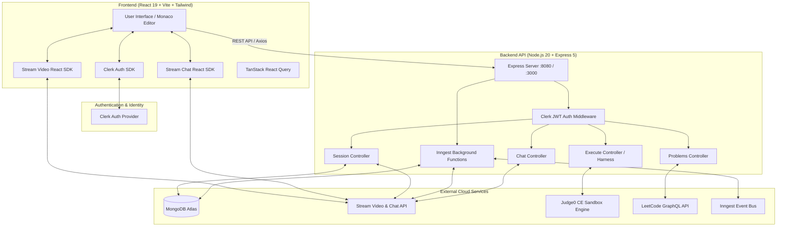
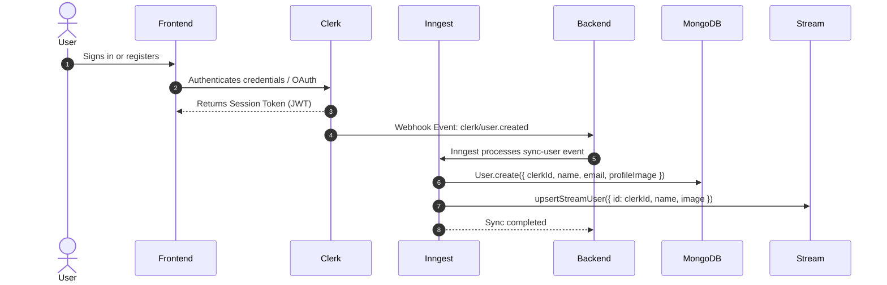
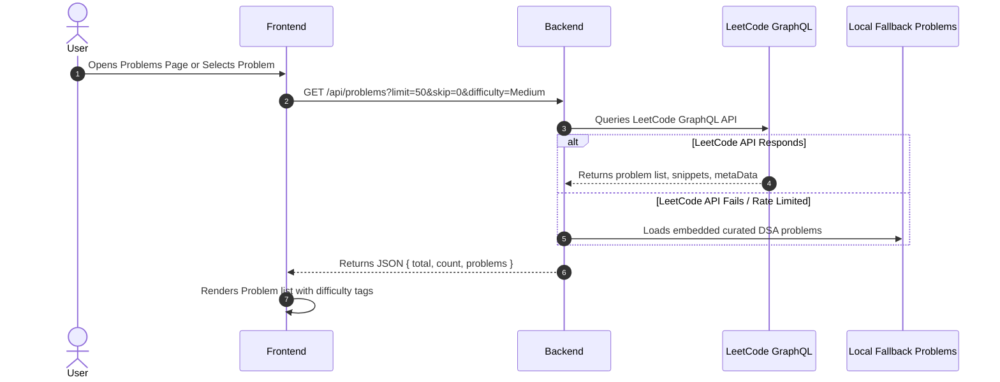
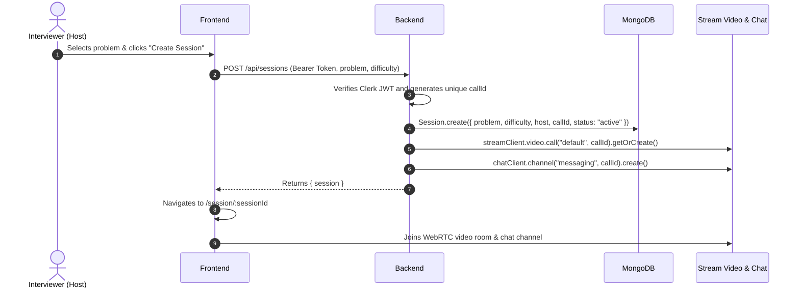
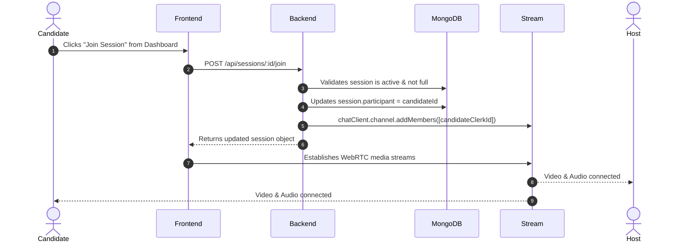
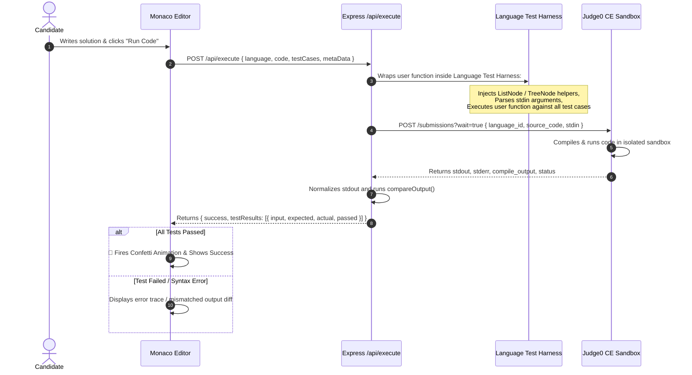
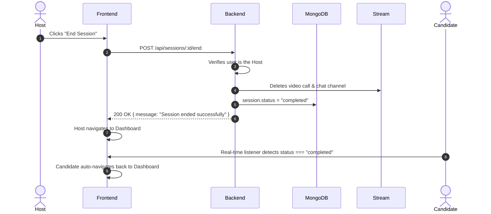

# 📐 MiTime (Talent-IQ) — System Architecture & Flow Guide

---

## 🗺️ High-Level System Architecture



---

## 📦 Core Data Models (MongoDB)

### 1. `User` Model
Stores synchronized profile information from Clerk:
```json
{
  "_id": "ObjectId(...)",
  "clerkId": "user_2xxxxxxxxx",
  "email": "candidate@example.com",
  "name": "Alex Doe",
  "profileImage": "https://img.clerk.com/...",
  "createdAt": "2026-08-16T12:00:00Z"
}
```

### 2. `Session` Model
Stores technical interview rooms:
```json
{
  "_id": "ObjectId(...)",
  "problem": "Two Sum",
  "difficulty": "Easy",
  "host": "ObjectId(User)",
  "participant": "ObjectId(User) | null",
  "callId": "session_17238123456_abc123",
  "status": "active" | "completed",
  "createdAt": "2026-08-16T12:00:00Z"
}
```

---

## 🔄 End-to-End Request Flows

### 1. Authentication & Background Sync Flow



---

### 2. Problem Catalog & Search Flow



---

### 3. Interview Room Creation & Real-Time Setup



---

### 4. Candidate Joining a Live Session



---

### 5. Automated Code Execution & Evaluation Engine



---

### 6. Ending Session & Teardown



---

## 📡 API Endpoint Inventory

| Method | Endpoint | Auth Required | Description |
| :--- | :--- | :--- | :--- |
| `GET` | `/health` | No | Health check endpoint for uptime monitors / Cloud Run |
| `GET` | `/api/chat/token` | Yes | Generates Stream Chat user token for authenticated client |
| `POST` | `/api/sessions` | Yes | Creates a new interview session, video call, and chat room |
| `GET` | `/api/sessions/active` | Yes | Retrieves list of all currently open interview sessions |
| `GET` | `/api/sessions/my-recent` | Yes | Retrieves user's past completed interview sessions |
| `GET` | `/api/sessions/:id` | Yes | Fetches single session details by ID |
| `POST` | `/api/sessions/:id/join` | Yes | Candidate joins an active session |
| `POST` | `/api/sessions/:id/end` | Yes | Host terminates and archives the session |
| `POST` | `/api/execute` | No / Yes | Runs user code against test harness using Judge0 |
| `GET` | `/api/problems` | Yes | Fetches paginated problem catalog with starter code & metadata |
| `GET` | `/api/problems/:slug` | Yes | Fetches detailed problem description, examples, and snippets |
| `ALL` | `/api/inngest` | Webhook Key | Inngest event router for background Clerk synchronization |

---

## 🔒 Security & Performance Features

1. **Sandboxed Code Execution**: All user code is executed remotely on **Judge0 CE** isolated compute environments, protecting the core backend server from infinite loops, malicious scripts, and resource exhaustion.
2. **Zero-Trust JWT Verification**: Every protected API route runs through `clerkMiddleware()` and custom `protectRoute` to validate user identity directly against Clerk authentication before accessing database records.
3. **Deterministic Output Comparison**: The `compareOutput` engine supports deep JSON matching, whitespace normalization, float tolerances ($10^{-5}$), and custom data structures (`ListNode`, `TreeNode`).
