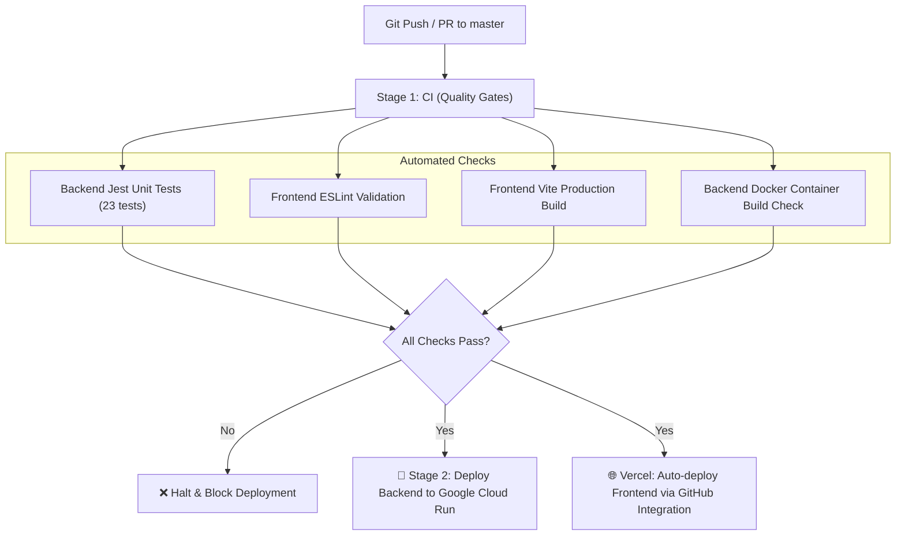

# 🚀 CI/CD Pipeline Setup & Verification Guide

This repository is equipped with an automated **CI/CD pipeline using GitHub Actions** ([.github/workflows/ci-cd.yml](.github/workflows/ci-cd.yml)).

---

## 🏗️ How It Works



---

## 🔒 Security: Keyless Workload Identity Federation

Your Google Cloud project (`project-40dd357d-acda-45a7-a15`) is linked directly to your GitHub repository (`aaditya156/MiTime_Org1`). 

* **No `.json` secret keys required in GitHub!**
* Authentication uses short-lived, encrypted OIDC tokens.
* Only commits and builds from `aaditya156/MiTime_Org1` are authorized to deploy to your Cloud Run service `talent-iq-backend`.

---

## 🧪 Local Testing

You can run test suites locally at any time:

```bash
# Run all backend unit tests
npm test

# Run frontend linting
npm run lint

# Run frontend production build
npm run build
```

---

## 🚢 Triggering Your First Automated Deployment

To deploy your changes automatically:

```bash
git add .
git commit -m "feat: setup automated CI/CD with tests and Google Cloud Run deployment"
git push origin master
```

You can watch the automated pipeline execute in real time under the **Actions** tab of your GitHub repository.
