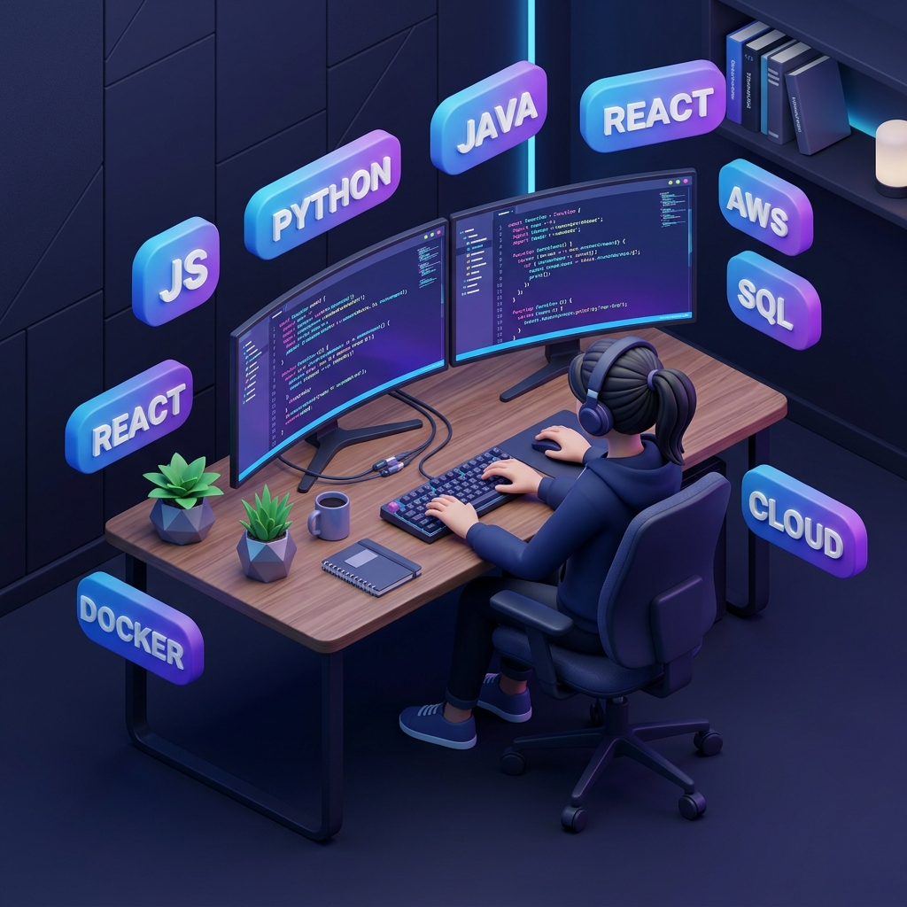

<div align="center">

  <h1>⚡ MiTime ⚡</h1>
  <p><b>Next-Generation Real-Time Technical Interview & Solo Coding Platform</b></p>

  <p>
    <a href="#-key-features">Key Features</a> •
    <a href="#-tech-stack">Tech Stack</a> •
    <a href="#-getting-started">Getting Started</a> •
    <a href="#-environment-variables-setup">Environment Setup</a> •
    <a href="#-deployment">Deployment</a>
  </p>

  <!-- Badges -->
  <p>
    
    
    
    
    
    
  </p>

  <br />

  

</div>

<br />

---

## 📌 About MiTime

**MiTime** is a modern, full-stack collaborative interview platform built for conducting seamless technical coding interviews and solo practice. It combines live multi-language code execution, low-latency 1-on-1 video call rooms, interactive real-time chat, and automated problem validation into a single, intuitive interface.

---

## 📸 Screenshots & Showcase

<div align="center">
  
  <p><i>Live Collaborative Workspace with Video Call, Code Editor, and Execution Panel</i></p>
</div>

---

## ✨ Key Features

### 🧑‍💻 VSCode-Powered Collaborative Code Editor
- **Monaco Code Editor**: Full-featured code editor with syntax highlighting, auto-completion, and multi-language support (JavaScript, Python, Java).
- **Isolated Code Execution**: Secure server-side execution environment with instant output and test case evaluation.
- **Auto Feedback & Celebration**: Success alerts with confetti animations on test case pass, and descriptive failure reports on error.

### 🎥 Live 1-on-1 Video Interview Rooms
- **HD Video & Audio Rooms**: WebRTC-powered video conferencing using **Stream Video SDK**.
- **Room Control & Safety**: Mic/Camera toggle, screen sharing, recording support, and room locking (enforcing maximum 2 active participants).

### 💬 Real-Time Chat & Collaboration
- Instant messaging between interviewer and candidate embedded directly alongside the code editor.
- Live stats dashboard tracking current active sessions and interview history.

### 🧠 Async Background Tasks & Webhooks
- Powered by **Inngest** for reliable event-driven background job processing and webhook handlers.

---

## 🛠️ Tech Stack

| Domain | Technologies |
| --- | --- |
| **Frontend** | React 18, Vite, Tailwind CSS, Monaco Editor, Lucide Icons, TanStack Query |
| **Backend** | Node.js 20, Express 5, Mongoose (MongoDB Atlas), Inngest Engine |
| **Auth & Security** | Clerk Authentication (OAuth, JWT, Session Management) |
| **Video & Chat** | Stream Video SDK (`@stream-io/video-react-sdk`), Stream Chat SDK |
| **Cloud & DevOps** | Google Cloud Run, GCP Artifact Registry, Docker, Vercel |

---

## 📁 Project Structure

```text
mi-time/
├── backend/
│   ├── src/
│   │   ├── controllers/      # Route logic & request handlers
│   │   ├── lib/              # Database, Inngest, Stream & env configs
│   │   ├── models/           # Mongoose schemas & data models
│   │   ├── routes/           # Express API endpoints
│   │   └── server.js         # Server entry point
│   ├── Dockerfile            # Production multi-stage Docker build
│   ├── .gcloudignore         # GCP build exclusion rules
│   └── package.json
├── frontend/
│   ├── public/               # Static assets & screenshots
│   ├── src/
│   │   ├── api/              # Axios / API services
│   │   ├── components/       # Reusable UI components & editor widgets
│   │   ├── pages/            # App pages (Dashboard, Room, Problems)
│   │   └── App.jsx
│   └── package.json
├── .github/
│   └── workflows/
│       └── ci-cd.yml         # GitHub Actions CI/CD pipeline
└── CI_CD_SETUP_GUIDE.md      # CI/CD secrets & deployment guide
```

---

## 🔑 Environment Variables Setup

Create `.env` files in both `backend` and `frontend` directories:

### Backend (`backend/.env`)

```env
PORT=3000
NODE_ENV=development

# Database
DB_URL=mongodb+srv://<user>:<password>@<cluster>.mongodb.net/mi-time

# Background Jobs
INNGEST_EVENT_KEY=your_inngest_event_key
INNGEST_SIGNING_KEY=your_inngest_signing_key

# Video & Chat API
STREAM_API_KEY=your_stream_api_key
STREAM_API_SECRET=your_stream_api_secret

# Authentication
CLERK_PUBLISHABLE_KEY=your_clerk_publishable_key
CLERK_SECRET_KEY=your_clerk_secret_key

# CORS
CLIENT_URL=http://localhost:5173
```

### Frontend (`frontend/.env`)

```env
VITE_CLERK_PUBLISHABLE_KEY=your_clerk_publishable_key
VITE_STREAM_API_KEY=your_stream_api_key
VITE_API_URL=http://localhost:3000/api
```

---

## 🚀 Getting Started Locally

### Prerequisites
- Node.js 18+ and `npm` installed.
- Running MongoDB Atlas cluster.
- Free accounts on Clerk, Stream, and Inngest.

### 1. Clone Repository
```bash
git clone https://github.com/aaditya156/MiTime_Org1.git
cd mi-time
```

### 2. Start Backend Server
```bash
cd backend
npm install
npm run dev
```
> Server runs on `http://localhost:3000`

### 3. Start Frontend Client
```bash
cd ../frontend
npm install
npm run dev
```
> Client runs on `http://localhost:5173`

---

- **CI/CD Pipeline**: Fully automated GitHub Actions workflow that runs Jest unit tests, frontend linting, and build checks on every push/PR before automatically deploying:
  - **Backend**: Deploys container image to **Google Cloud Run**.
  - **Frontend**: Deploys production bundle to **Vercel**.
  - 📖 See [CI_CD_SETUP_GUIDE.md](./CI_CD_SETUP_GUIDE.md) for full configuration & secrets setup.

---

<div align="center">
  <p>Made with ❤️ for interviewers & developers</p>
</div>
